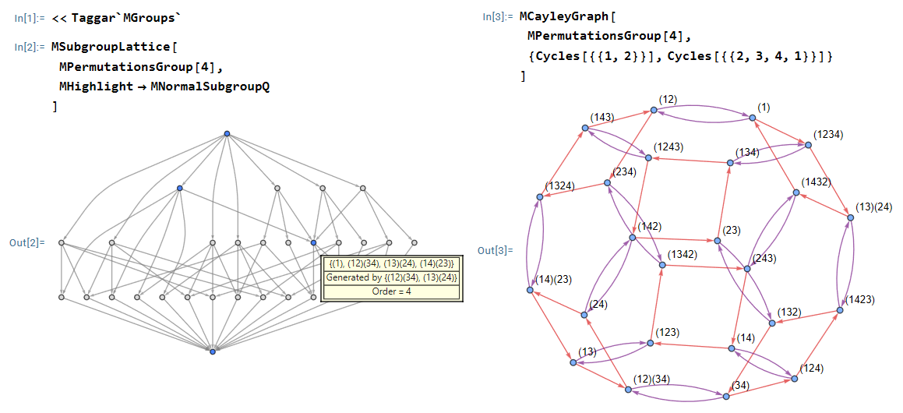

# Summary

Group theory plays fundamental roles in both pure and applied mathematics, serving as a powerful framework for studying symmetry, structure, and transformations. Its applications span diverse areas such as algebra, number theory, geometry, physics, cryptography, and computer science among others. In recent years, computational tools have become increasingly important for exploring and experimenting with abstract algebraic structures. **MGroups** is a Mathematica package developed to support basic study of finite group structures. It offers a user-friendly interface for performing a wide range of computations involving finite groups such as cyclic groups, unit groups modulo n, dihedral groups, symmetric groups, and more. The package allows users to construct and analyse groups in terms of Cayley tables/graphs, subgroup enumeration and lattices, group homomorphisms, cosets, and related structural investigations.

# Statement of need

Computational tools play a vital role in modern mathematics by automating complex and often tedious calculations, thereby freeing users from manual labour and enabling deeper exploration of abstract concepts. In educational settings, such tools are known to enhance learning by supporting experimentation, visualisation, and active engagement with abstract structures, particularly when used alongside formal theory (@artigue). One of the most powerful and well-established systems in discrete algebras is @gap, which provides extensive capabilities for working with groups, rings, vector spaces, and more. GAP is widely used in research and advanced applications, offering deep algorithmic functionality and a rich library of algebraic data. However, its syntax and interface can be less accessible to beginners or those unfamiliar with command-line environments.

In contrast, MGroups is a Mathematica package developed with an emphasis on ease of use, accessibility, and pedagogical support. It is designed primarily for undergraduate students beginning with group theory, as well as for educators seeking a user-friendly tool to demonstrate group-theoretic concepts interactively. The package leverages Mathematica's intuitive syntax and symbolic computation engine to simplify many standard tasks, such as constructing Cayley tables, studying subgroups structures, exploring group morphisms, and so on. These operations can typically be performed using simple, one-line commands, greatly lowering the barrier to entry for new learners.

While tools like GAP remain the appropriate choice for large-scale or research-level computations, packages like MGroups fill a complementary niche by providing a gentle and engaging entry point to computational group theory within familiar and friendly environments.

# Design

The package stores group structures using precomputed Cayley tables and simple lookups rather than recalculating on-the-fly. This keeps behaviour predictable and makes repeated operations faster and easier to reason about for users.

# Installation and usage

The package is hosted at the Wolfram Paclet Repository[^1] and can be installed using the single command

```mathematica
PacletInstall["Taggar/MGroups"]
```

Once installed, it can be loaded (imported) by running

```mathematica
Needs["Taggar`MGroups`"]
```

Below I present some basic examples using the package

```mathematica
d = {0, 1, 2, 3, 4, 5}
f[x_, y_] := Mod[x+y, 6]
z6 = FormMGroup[d, f]

MCayleyTable[z6] (* see the Cayley table *)
Table[MCayleyGraph[z6, gen],
	{gen, {{1}, {2}, {1,2}}}] (* see Cayley graph using 
                                   various generating sets *)

MSubgroupLattice[MPermutationGroup[4]] (* subgroups of the
                              group of permutations on 4 symbols *)

g = MAdditiveGroup[12]
h = {0, 6}
MFactorGroup[g, h] (* factor group g/h *)
MHomomorphism[g, g, #&] (* homomorphism from g to itself *)
```

As a special mention, the subgroup lattice and Cayley graph generated using the package are illustrated in Figure #fig:s4.

{#fig:s4}

[^1]: https://resources.wolframcloud.com/PacletRepository/resources/Taggar/MGroups/

# State of the field

A variety of computational tools for group theory are currently available, each addressing different audiences and use cases. Dedicated systems such as @gap provide extensive algorithmic depth and are widely used in research-level computations involving groups, rings, and representations. General computer algebra systems such as Maple and Mathematica include group-theoretic functionality as part of a broader symbolic framework, though such functionality is often dispersed and not tailored specifically to introductory group theory. For the sake of review, Maple contains over 150 group theory related commands, and Mathematica's support is comparatively smaller and mostly built in terms of permutation groups. Within the Mathematica ecosystem, specialised packages such as @gtpack and @groupmath extend native capabilities, with a particular emphasis on representation theory, symmetry analysis, and applications in physics. Programming-language libraries, such as the @haskell package in Haskell, support abstract algebraic structures within software development workflows but are not designed as interactive educational tools. In contrast, MGroups is designed as a lightweight, pedagogy-oriented Mathematica package that focuses on core topics in finite group theory, offering a unified and accessible interface aimed at students and instructors rather than large-scale or research-oriented computation.

# Conclusion

MGroups provides an accessible and practical entry point to computational finite group theory for Mathematica users. By prioritising clarity, ease of use, and pedagogical relevance, it complements existing research-oriented software and supports both teaching and exploratory learning in group theory.

# References